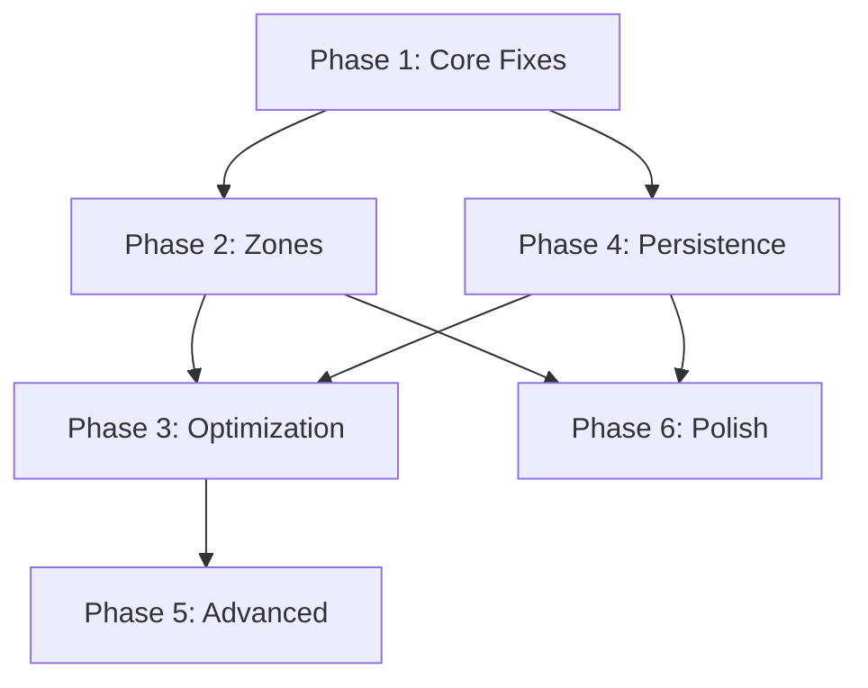

# Spaghetti Diagram Application - Complete Development Plan

## Executive Summary
The Spaghetti Diagram App is a web-based tool for creating workflow optimization diagrams. Users can upload floor plans (PDF/image), place objects, draw paths, define zones, calculate metrics, and optimize routes. This plan outlines the steps to complete the application from its current state to full functionality.

## Current State Assessment

### ✅ Working Features
1. **Background Management**
   - Image upload and display
   - PDF upload (first page only)
   - Rotate, flip, zoom, pan controls
   - Background persistence in view

2. **Object Management**
   - Object palette with predefined templates
   - Click to add objects
   - Drag-and-drop object placement
   - Object selection and movement
   - Object resizing via handles
   - Object property editing (name, type)

3. **Basic UI Structure**
   - Sidebar with tools and analytics
   - Canvas with overlay system
   - Modal dialogs for properties
   - Scale calibration UI
   - Metrics display panel

4. **View Controls**
   - Zoom in/out with mouse wheel
   - Pan with middle mouse or drag
   - Reset view/zoom buttons
   - Grid overlay with scale

### ⚠️ Issues Found
1. **Missing Delete Modal** - Referenced in code but not in HTML
2. **Path Drawing** - Implemented but needs refinement
3. **Zones** - Not implemented
4. **Route Optimization** - Not implemented
5. **Persistence** - Only scale saved, not full project
6. **Multi-page PDF** - Not supported
7. **Export/Import** - Export works, import missing
8. **Comparison View** - Not implemented

## Tech Stack
- **Frontend**: Vanilla JavaScript, HTML5 Canvas
- **Libraries**: PDF.js for PDF rendering
- **Storage**: LocalStorage for persistence
- **Styling**: CSS3 with custom properties
- **Build**: None (static files)

---

## Phase 1: Core Fixes & Path System (Priority: HIGH)
**Timeline: 2-3 days**

### 1.1 Fix Missing Delete Modal
```html
<!-- Add to index.html before closing </div> of app-container -->
<div class="modal hidden" id="deleteModal" role="dialog" aria-modal="true">
    <div class="modal-content">
        <div class="modal-header">
            <h3>Confirm Delete</h3>
            <button class="modal-close" id="closeDeleteModal">&times;</button>
        </div>
        <div class="modal-body">
            <p id="deleteMessage"></p>
            <p id="deleteWarning" class="text-warning hidden"></p>
        </div>
        <div class="modal-footer">
            <button class="btn btn--secondary" id="cancelDelete">Cancel</button>
            <button class="btn btn--danger" id="confirmDelete">Delete</button>
        </div>
    </div>
</div>
```

### 1.2 Enhance Path Drawing System
- **Smart Path Routing**: Implement path smoothing and corner rounding
- **Snap-to-Object**: Paths automatically connect to object centers
- **Path Editing**: Click existing path to add/remove points
- **Visual Feedback**: Show path preview while drawing
- **Collision Detection**: Highlight when paths cross obstacles

### 1.3 Implement Path Metrics
- Calculate actual distance based on scale
- Track frequency and calculate weighted metrics
- Show path efficiency scores
- Heat map visualization for high-traffic areas

### 1.4 Fix Coordinate System Issues
- Ensure objects stay in world coordinates during pan/zoom
- Fix background transform affecting object positions
- Implement proper hit testing for transformed views

**Files to modify**: `app.js`, `index.html`, `style.css`

---

## Phase 2: Zones & Advanced Analytics (Priority: HIGH)
**Timeline: 3-4 days**

### 2.1 Zone Drawing Tools
```javascript
// New zone types to implement
const zoneTypes = {
    'safe': { color: 'rgba(0,255,0,0.2)', label: 'Safe Zone' },
    'restricted': { color: 'rgba(255,0,0,0.2)', label: 'No-Go Zone' },
    'storage': { color: 'rgba(0,0,255,0.2)', label: 'Storage Zone' },
    'work': { color: 'rgba(255,255,0,0.2)', label: 'Work Area' }
};
```

### 2.2 Zone Features
- Polygon drawing tool for irregular shapes
- Rectangle tool for quick zones
- Zone layering and transparency
- Zone properties (type, restrictions, cost modifier)
- Zone-aware path routing

### 2.3 Enhanced Analytics Dashboard
- **Spaghetti Index**: Measure of path complexity
- **Efficiency Score**: Optimal vs actual distance
- **Time Estimates**: Based on walking speed
- **Bottleneck Detection**: Identify congestion points
- **Zone Utilization**: Time spent in each zone

### 2.4 Real-time Metrics Updates
- Live calculation as paths are drawn
- Visual indicators for inefficient routes
- Suggestion system for improvements

**New files**: `zones.js`, `analytics.js`

---

## Phase 3: Route Optimization Engine (Priority: MEDIUM)
**Timeline: 4-5 days**

### 3.1 Optimization Algorithms
```javascript
class RouteOptimizer {
    // Implement multiple algorithms
    algorithms = {
        'shortest': this.dijkstraShortestPath,
        'minimal-turns': this.minimalTurnsPath,
        'zone-aware': this.zoneAwarePath,
        'multi-stop': this.tspOptimization
    };
    
    optimize(start, end, waypoints, constraints) {
        // Core optimization logic
    }
}
```

### 3.2 Features
- **Shortest Path**: Dijkstra's algorithm with obstacle avoidance
- **Multi-stop Optimization**: TSP solver for multiple destinations
- **Zone Constraints**: Respect no-go zones and preferences
- **Object Relocation**: Suggest optimal object positions
- **Batch Optimization**: Optimize all paths simultaneously

### 3.3 Visualization
- Show original vs optimized paths
- Animate path optimization process
- Display savings metrics
- Color-code improvement areas

**New files**: `optimizer.js`, `pathfinding.js`

---

## Phase 4: Persistence & Project Management (Priority: HIGH)
**Timeline: 2-3 days**

### 4.1 Complete Save/Load System
```javascript
class ProjectManager {
    saveProject() {
        return {
            version: '2.0',
            metadata: { name, created, modified },
            background: { image, transform, scale },
            objects: [...],
            paths: [...],
            zones: [...],
            scenarios: [...]
        };
    }
    
    loadProject(data) {
        // Restore complete application state
    }
}
```

### 4.2 Features
- **Auto-save**: Every 30 seconds
- **Project Library**: Manage multiple projects
- **Version History**: Undo/redo with snapshots
- **Cloud Sync**: Optional cloud storage integration
- **Import/Export**: JSON, CSV data formats

### 4.3 Scenario Management
- Save multiple layout versions
- Quick scenario switching
- Scenario comparison mode
- A/B testing support

**New files**: `storage.js`, `scenarios.js`

---

## Phase 5: Advanced Features (Priority: LOW)
**Timeline: 3-4 days**

### 5.1 Multi-page PDF Support
- Page navigation controls
- Page thumbnails
- Different objects per page
- Cross-page path connections

### 5.2 Collaboration Features
- Share read-only links
- Comment system
- Change tracking
- Export presentations

### 5.3 Advanced Visualizations
- 3D view option
- Time-lapse animation
- Heat map overlays
- Traffic flow simulation

### 5.4 Integration Options
- REST API for external tools
- Webhook notifications
- Data pipeline connections
- ERP system integration

**New files**: `collaboration.js`, `visualization.js`, `api.js`

---

## Phase 6: UI/UX Polish & Performance (Priority: MEDIUM)
**Timeline: 2-3 days**

### 6.1 UI Improvements
- **Dark Mode**: Toggle between light/dark themes
- **Responsive Design**: Mobile and tablet support
- **Keyboard Shortcuts**: Complete shortcut system
- **Context Menus**: Right-click actions
- **Tooltips**: Helpful hints throughout

### 6.2 Performance Optimization
- **Canvas Layering**: Separate static/dynamic content
- **WebGL Rendering**: For complex diagrams
- **Virtual Scrolling**: For large object lists
- **Worker Threads**: Offload calculations
- **Lazy Loading**: Load features on demand

### 6.3 Accessibility
- **ARIA Labels**: Complete coverage
- **Keyboard Navigation**: Full app control
- **Screen Reader**: Optimized descriptions
- **High Contrast**: Mode for visibility
- **Text Scaling**: Adjustable UI text

**Files to modify**: All UI components

---

## Implementation Order & Dependencies



## Testing Strategy

### Unit Tests
- Path calculation algorithms
- Zone intersection logic
- Optimization algorithms
- Data serialization

### Integration Tests
- Save/load cycles
- Import/export formats
- Multi-step workflows
- Performance benchmarks

### User Acceptance Tests
- Real workflow scenarios
- Usability testing
- Performance on large diagrams
- Cross-browser compatibility

## Deployment Strategy

### Development Environment
```bash
# Local development server
python -m http.server 8080
# Or Node.js
npx http-server -p 8080
```

### Production Build
```bash
# Minify and bundle
npm run build
# Deploy to CDN
npm run deploy
```

### Hosting Options
1. **Static Hosting**: GitHub Pages, Netlify, Vercel
2. **Cloud Platform**: AWS S3 + CloudFront
3. **Enterprise**: On-premise deployment
4. **SaaS Model**: Multi-tenant architecture

## Success Metrics

### Technical KPIs
- Page load time < 2 seconds
- Canvas render @ 60 FPS
- Save operation < 500ms
- Optimization < 1 second for 100 objects

### User KPIs
- Task completion rate > 90%
- Error rate < 1%
- User satisfaction > 4.5/5
- Time to first diagram < 5 minutes

## Risk Mitigation

### Technical Risks
- **Browser Compatibility**: Test on Chrome, Firefox, Safari, Edge
- **Performance**: Implement progressive enhancement
- **Data Loss**: Auto-save and recovery features
- **Security**: Input validation and sanitization

### User Risks
- **Learning Curve**: Interactive tutorials
- **Feature Discovery**: Progressive disclosure
- **Error Recovery**: Undo/redo system
- **Migration**: Import from other tools

---

## Next Steps

### Immediate Actions (Today)
1. ✅ Fix delete modal HTML
2. ✅ Test and verify all current features
3. ✅ Create development branch
4. ✅ Set up local testing environment

### This Week
1. Implement Phase 1 path improvements
2. Add comprehensive project save/load
3. Begin zone drawing tools
4. Create user documentation

### This Month
1. Complete Phases 1-4
2. Beta testing with users
3. Performance optimization
4. Prepare for production deployment

## Resources & Documentation

### Technical Documentation
- [PDF.js Documentation](https://mozilla.github.io/pdf.js/)
- [Canvas API Reference](https://developer.mozilla.org/en-US/docs/Web/API/Canvas_API)
- [Web Storage API](https://developer.mozilla.org/en-US/docs/Web/API/Web_Storage_API)

### Design Resources
- Material Design Guidelines
- Accessibility Guidelines (WCAG 2.1)
- Performance Best Practices

### Community & Support
- GitHub Issues for bug tracking
- Discord/Slack for user community
- Stack Overflow for technical questions
- User forum for feature requests

---

## Conclusion

The Spaghetti Diagram App has a solid foundation with working background management, object placement, and basic UI. The path forward focuses on completing core functionality (paths, zones, optimization) before adding advanced features. The phased approach ensures each feature is properly implemented and tested before moving to the next.

**Estimated Total Timeline**: 4-6 weeks for full implementation
**Recommended Team Size**: 1-2 developers
**Budget Consideration**: Primarily development time + hosting costs

The modular architecture allows for parallel development of features and easy maintenance. The app can be deployed incrementally, with each phase adding value for users.
